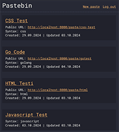
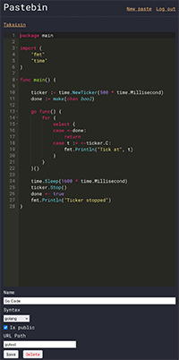

# Pastebin
Minimalistic pastebin application written in Go.

This is mainly meant for small personal use. It is probably not the most performant or secure, but it is simple! No user management and no database. The application stores everything in a single YAML file.

## Dependencies
- [go-chi](https://github.com/go-chi/chi) (HTTP router)
- [jwt-go](github.com/golang-jwt/jwt/) (JWT handling)
- [uuid](github.com/google/uuid) (UUID generation)
- [go-yaml](gopkg.in/yaml.v3) (YAML handling)
- [Ace](https://ace.c9.io/) (HTML code editor)

## Configuration
 Copy the following files:
- config.yaml.example ➔ config.yaml
- docker-compose.yaml.example ➔ docker-compose.yaml

Create an empty file called `documents.yaml`. On *nix systems you can use `touch documents.yaml`.

Configure the settings in config.yaml. The important ones are:
- `password` is needed to manage the documents
- `jwtSecret` is the secret used in JWT tokens. You can use the generated value from [UUID Generator](https://www.uuidgenerator.net/)

## Running with Docker
Simply run `docker-compose up [-d]`.

By default the app will run on port `8000`. You can change the port in `docker-compose.yaml`.

## Screenshots

