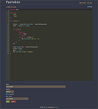

# Pastebin
Minimalistic pastebin application written in Go.

This is mainly meant for small personal use where strong security is not needed. It is not the most performant or secure, but it is simple! No user management and no database. The application stores everything in a single YAML file.

## Dependencies
- [go-chi](https://github.com/go-chi/chi) (HTTP router)
- [jwt-go](github.com/golang-jwt/jwt/) (JWT handling)
- [uuid](github.com/google/uuid) (UUID generation)
- [go-yaml](gopkg.in/yaml.v3) (YAML handling)
- [slug](https://github.com/gosimple/slug) (Slug handling)
- [Ace](https://ace.c9.io/) (HTML code editor)

## Supported languages/formats
The editor supports syntax highlighting for the following languages/formats
- css
- golang
- html
- javascript
- json
- markdown
- python
- sass
- scss
- sql
- text
- typescript
- vue
- xml

## Configuration
1. Copy `config.yaml.example` ➔ `config.yaml`
2. Copy `docker-compose.yaml.example` ➔ `docker-compose.yaml`
3. Create an empty file named `documents.yaml`
4. Configure the settings in `config.yaml`.

| Setting       | Description |
| ------------- | ----------- |
| baseUrl       | Base URL of the pastebin site e.g. https://mypastebin.com. |
| title         | Title of the pastebin site. |
| theme         | Active theme (not supported yet). |
| password      | Password used to login. |
| jwtSecret     | Secret used to sign the JWT. You can use [random.org](https://www.random.org/strings/?num=1&len=32&digits=on&upperalpha=on&loweralpha=on&unique=on&format=html&rnd=new) to generate one. |
| defaultSyntax | Default [syntax](#supported-languagesformats) used for editor highlighting |

## Running with Docker
Just run `docker compose up [-d]`.

By default, the application will run on port `8000`. You can change the port forwarding in `docker-compose.yaml`. For example, if you want the application to run on port 15000, set the following in `docker-compose.yaml` file:

```yaml
    ports:
      - "15000:8000"
```

## Screenshots
UI on bigger screens

[](docs/admin-list.jpg)
[](docs/admin-editor.jpg)
[](docs/public-view.jpg)

UI on mobile devices

[](docs/mobile-admin-list.jpg)
[](docs/mobile-admin-editor.jpg)
[](docs/mobile-public-view.jpg)